# BigBanana AI Director (AI 漫劇工場)

> **AI 一站式 短編ドラマ／モーションコミック生成プラットフォーム**
> *Industrial AI Motion Comic & Video Workbench*

[](./README.md)
[](./README_EN.md)
[](./README_JA.md)
[](https://creativecommons.org/licenses/by-nc-sa/4.0/)

**BigBanana AI Director** は、**AI 一站式の短編ドラマ／モーションコミックプラットフォーム**です。アイデアから完成動画までを高速に制作したいクリエイター向けに設計されています。

従来の「ガチャ」的な生成手法を捨て、**「脚本 -> アセット -> キーフレーム」** という産業用ワークフローを採用しています。AntSK API の先進的な AI モデルを深く統合することで、**「一文で完全な短編ドラマを生成し、脚本から完成動画までを全自動化」** しつつ、キャラクターの一貫性、シーンの連続性、そしてカメラワークの精密な制御を実現しました。

## リリース方針

近頃、無断転載やクレジットなしの流用、さらに悪質なケースが繰り返し発生しているため、今後の更新は公式 Docker イメージのみで提供し、更新済みソースコードの公開は行いません。

このリポジトリは今後も公開ドキュメント兼、過去バージョンの参照用スナップショットとして残します。実際のデプロイとアップグレードは `docker-compose.yaml` と公式イメージを基準にしてください。
商用版ユーザーには、引き続き完全なソースコード一式を提供します。

## UI ショーケース

### プロジェクト管理
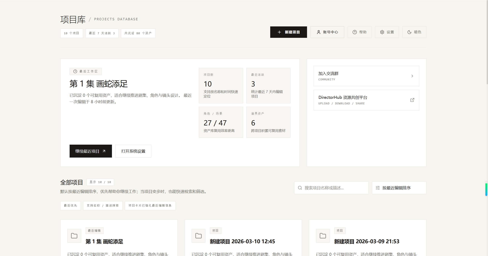

### プロジェクト概要と長編小説インポート


### 世界観構築


### Phase 01: 叙事プランニング
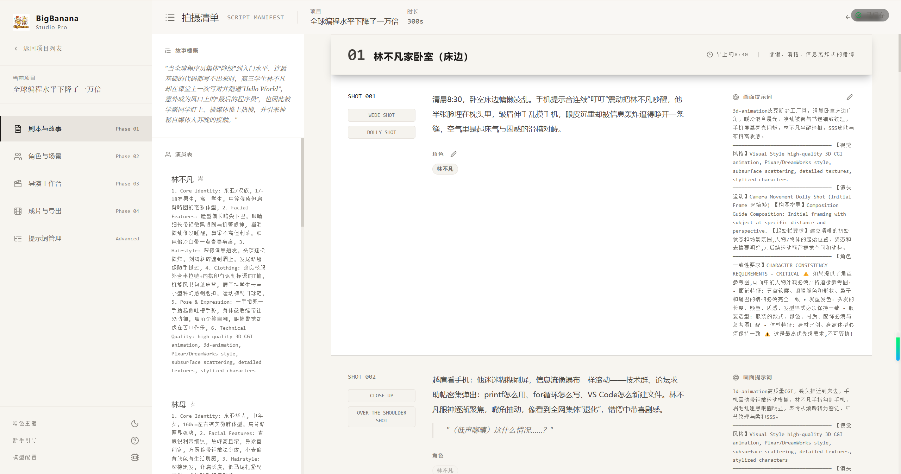
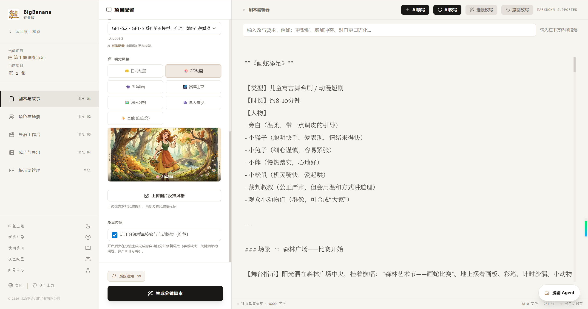

### Phase 02: 一貫性アセット
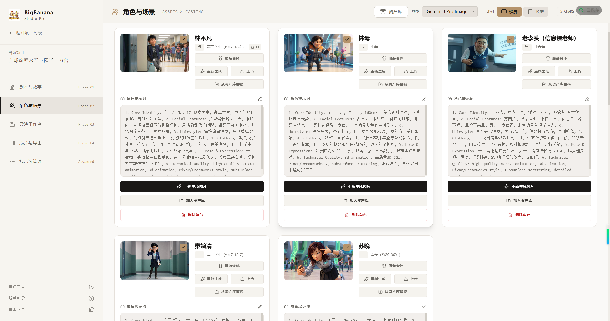
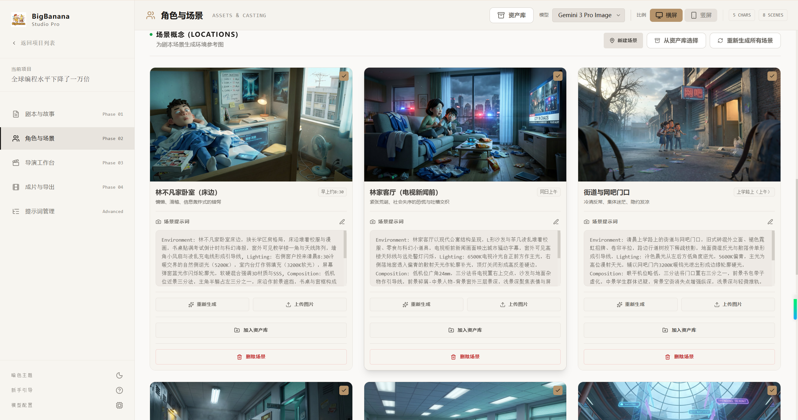


### Phase 03: ショット制作
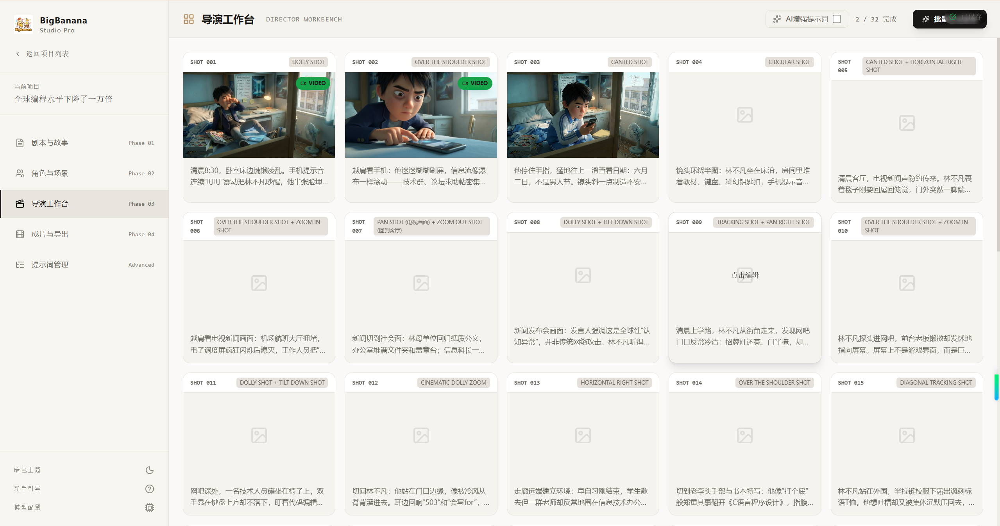
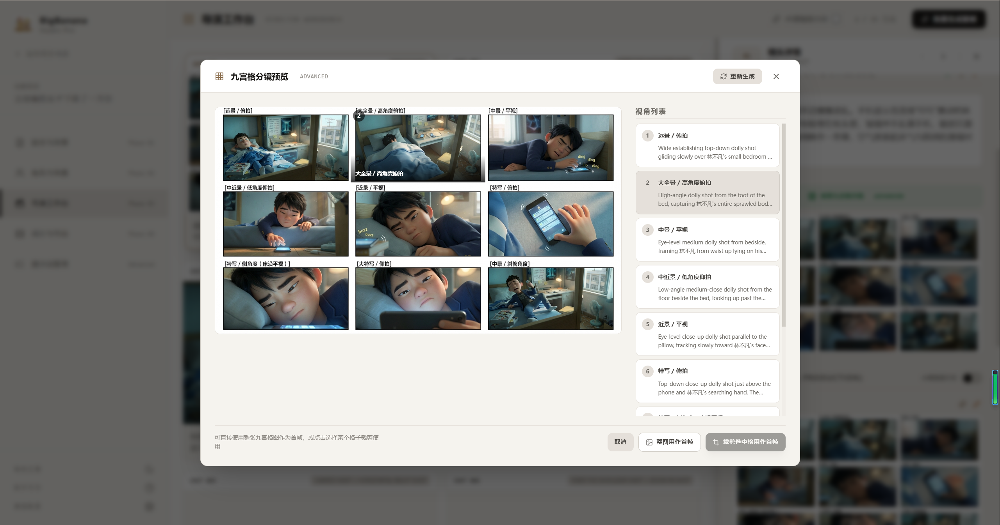
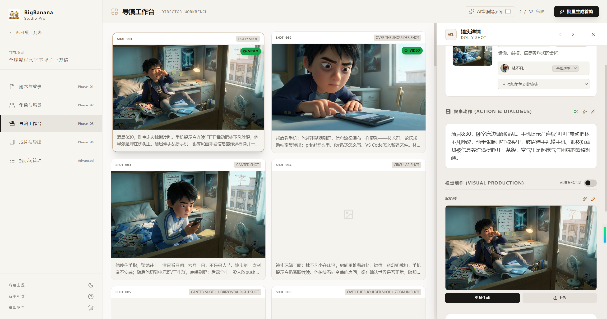
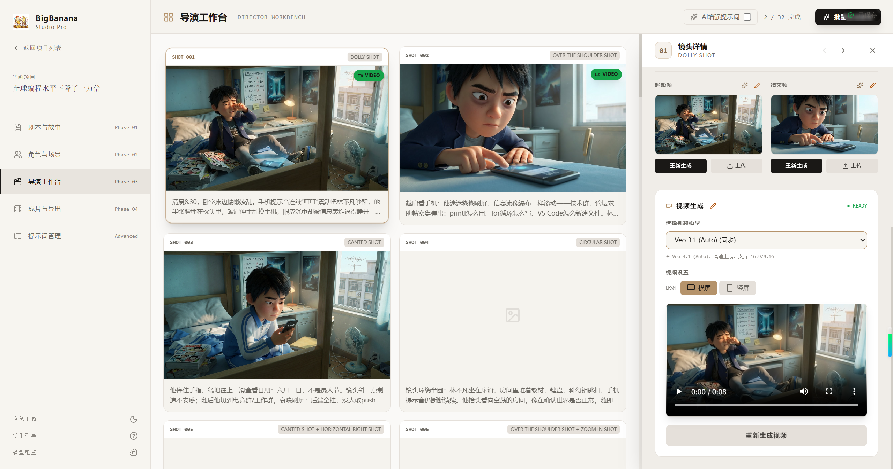

### Phase 04: 成片納品

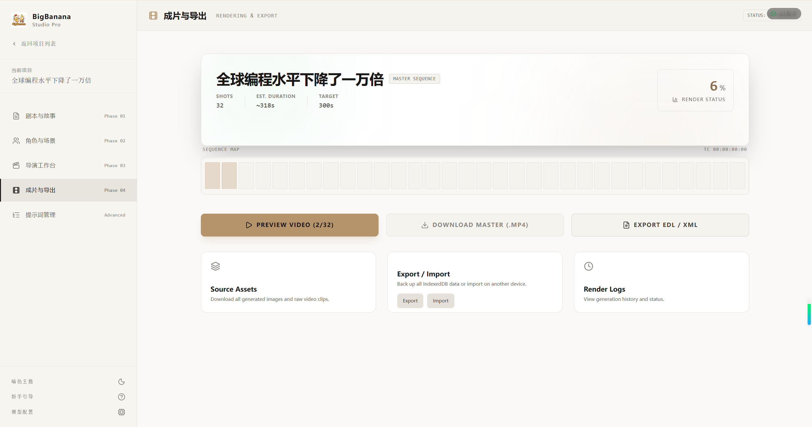

### プロンプト管理
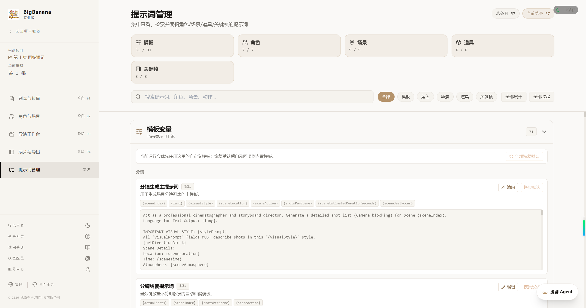

## 核となる概念：キーフレーム駆動 (Keyframe-Driven)

従来の Text-to-Video モデルでは、具体的なカメラの動きや開始・終了状態を制御することが困難でした。BigBanana はアニメーション制作における **キーフレーム (Keyframe)** の概念を導入しました：

1.  **静止画先行**: まず、正確な開始フレーム (Start) と終了フレーム (End) を生成します。
2.  **補間生成**: Veo モデルを使用して、2つのフレーム間に滑らかな動画トランジションを生成します。
3.  **アセット制約**: すべての画面生成は「キャラクター設定画」と「シーンコンセプト画」によって厳密に制約され、キャラクターの崩壊を防ぎます。

## 主な機能

### プロジェクト単位のワークフロー
*   **Project Hub**: 最近のプロジェクト、アカウント導線、モデル設定、グローバル資産ライブラリ、全体データのインポート / エクスポートを一か所で管理します。
*   **Project Overview**: `プロジェクト -> シーズン -> エピソード` で内容を整理し、長編小説の一括取り込みと複数話ドラフトへの自動分割、プロジェクト全体バックアップに対応します。
*   **Project Resources & Worldview**: 各話に入る前に、キャラクター・シーン・小道具・地図・地域・地点・音楽 / 世界観アンカーを蓄積し、後続の脚本、アセット、ショット生成へ継続的に反映します。

### Phase 01: 叙事プランニング (Narrative Planning)
*   **構造化脚本生成**: ストーリー概要、小説の一節、単話アイデアから、キャラクター・シーン・小道具・ショットを構造化して生成します。
*   **設定主導の生成**: 言語、目標尺、ビジュアルスタイル、モデル構成を先に決めて、全工程の出力を揃えます。
*   **AI 続稿 + 手動微調整**: 本文、キャラクター説明、ショットアクション、セリフ、各種プロンプトを AI で続稿 / 改稿しつつ、手動でも細かく調整できます。
*   **全自動プランの事前確認**: 一括生成前に AI が提案する全自動プランを確認し、ショットごとに九分割ストーリーボード経路かキーフレーム経路かを選べます。

### Phase 02: 一貫性アセット (Consistency Assets)
*   **キャラクター一貫性シート**: 各キャラクターの参照画像を生成し、ワードローブシステムで複数衣装を管理しながら同一人物性を保ちます。
*   **シーン / 小道具のアセット化**: 中核シーンだけでなく、再利用したい小道具にも独立したプロンプト、参照画像、形状参照を持たせられます。
*   **資産ライブラリ再利用**: プロジェクト内資産だけでなく、クロスプロジェクト資産ライブラリからもキャラクター、シーン、小道具を流用できます。
*   **不足アセットの一括補完**: ショット制作に入る前に、キャラクター・シーン・小道具の不足画像をまとめて補完できます。

### Phase 03: ショット制作 (Shot Workbench)
*   **グリッド型ショットワークベンチ**: すべてのショットを俯瞰管理し、各ショットでシーン、キャラクター、小道具、アクション文脈を確認できます。
*   **キーフレーム精密制御**: Start Frame / End Frame の生成、アップロード、継承、編集に対応し、ショット状態を細かく制御できます。
*   **九分割ストーリーボードプレビュー**: まず 9 つの候補視点を生成し、全体画像または任意パネルの切り出しを開始フレームとして採用できます。
*   **コンテキスト認識生成**: 現在のシーン画像、衣装参照、小道具参照を自動で読み込み、連続性破綻を減らします。
*   **2 系統の動画生成**: 単一画像の Image-to-Video と、開始 / 終了キーフレーム補間の両方をサポートします。

### Phase 04: 成片納品 (Delivery Center)
*   **タイムラインプレビューとレンダリング追跡**: 完成率、ラフカットのタイムライン、レンダリングログをリアルタイムで確認できます。
*   **CutOS 風 AI ラフカット**: 内蔵タイムラインエディタで、生成済みショットの並べ替え、トリミング、フィルタ適用、書き出し前確認が可能です。
*   **複数の納品形式**: マスタービデオ、ショット分割 ZIP、元素材を書き出し、Premiere や Resolve など後工程へ渡せます。
*   **エピソード単位バックアップ**: 現在話数のデータをインポート / エクスポートでき、端末間移行や共同作業に便利です。

### Phase 05: プロンプト管理 (Prompt Management)
*   **一元検索と編集**: テンプレート、キャラクター、シーン、小道具、キーフレーム、動画プロンプトを一か所で確認・編集できます。
*   **バージョン巻き戻し**: 編集履歴を保持し、以前のプロンプトへ素早く戻せます。
*   **工程横断の原因調査**: 出力が不安定なときに、この画面から上流プロンプトの問題を直接追跡・修正できます。

## 公開版の提供形態

*   **提供内容**：この公開リポジトリでは主にドキュメント、`docker-compose.yaml`、公式 Docker イメージのデプロイ入口を提供し、継続的なソース更新は同期しません。
*   **実行方式**：公式 Docker イメージからワークベンチ一式を起動し、ブラウザからそのまま利用できます。フロントエンドのビルドや個別サービスの組み立ては不要です。
*   **モデル接続**：標準ワークフローでは AntSK API を通じてテキスト・画像・動画モデルを一元的に利用します。
*   **データ保存**：プロジェクトデータは主にブラウザローカル環境に保存され、バージョン更新は公式イメージ経由で提供されます。

## AntSK API を選ぶ理由

本プロジェクトは [**AntSK API プラットフォーム**](https://api.antsk.cn/) を深く統合し、クリエイターに最高のコストパフォーマンスを提供します：

### 🎯 全モデル対応
* **テキストモデル**: GPT-5.2、GPT-5.1、Claude 4.6 Sonnet
* **ビジョンモデル**: Nano Banana Pro、Gpt Image 2
* **ビデオモデル**: Sora-2、Veo-3.1、Vidu、Seedance 2.0、happyhorse など
* **統一アクセス**：単一 API ですべてのモデルを利用可能、プラットフォーム切り替え不要

### 💰 圧倒的な価格優位性
* **公式価格の 2 割以下**：すべてのモデルで 80% 以上のコスト削減
* **従量課金制**：最低利用料金なし、使った分だけお支払い
* **エンタープライズグレードの安定性**：99.9% SLA 保証、24時間365日サポート

### 🚀 開発者フレンドリー
* **OpenAI 互換プロトコル**：既存コードの移行コストゼロ
* **充実したドキュメント**：完全な API ドキュメントとサンプルコード
* **リアルタイム監視**：視覚的な使用統計とコスト追跡

[**無料クレジットを取得する**](https://api.antsk.cn/) →

## ⚠️ ソース公開と「無料」について（必ずお読みください）

* **今後の更新提供方法**：盗用、クレジットなし転載、悪質な流用が繰り返し発生しているため、今後の機能更新は公式 Docker イメージのみで提供し、公開ソースコードとしては同期しません。
* **このリポジトリの位置づけ**：この公開リポジトリはドキュメント、`docker-compose.yaml`、および履歴参照情報として残します。デプロイとアップグレードは公式 Docker イメージの提供経路に従って行ってください。
* **商用版のソースコード提供について**：商用版ユーザーには、引き続き完全なソースコード一式を提供します。商用利用やライセンスのご相談は、文末の連絡先までお問い合わせください。
* **モデル利用について**：公開版で実行可能なバージョンは、公式 Docker イメージにあらかじめ構成された標準ワークフローを前提としており、能力に対応したモデル構成が必要です。例えば、大規模言語モデル（例：**GPT-5.2**）、画像モデル（例：**Nano Banana Pro**）、動画モデル（例：**Sora-2** / **Veo-3.1**）です。ほかの提供元、私有モデルゲートウェイ、または深いカスタマイズが必要な場合は、商用版ソースコード提供を前提に別途対応してください。
* **API 提供について**：私たちの API は、主に迅速な体験と統合のために提供しており、これを主要な収益源にする意図はありません。
* **選択の自由**：もし私たちの API が期待に合わない場合は、OpenAI や Google の公式サービスを直接利用していただいて問題ありません（価格が高くても構いません）。その選択は尊重されます。
* **「常時無料」前提について**：長期的に「無料であること」を最優先の判断基準にする場合、このプロジェクトは合わない可能性があります。

---

## 💬 コミュニティに参加

QRコードをスキャンして **BigBanana プロダクト体験グループ** に参加しましょう。他のクリエイターと交流し、最新情報を入手できます：

<div align="center">

<p><i>WeChat でスキャンしてグループに参加</i></p>
</div>

---

### 🎨 軽量クリエイティブツール推奨

**単発のクリエイティブタスク**を素早く完成させたい場合は、オンラインツールプラットフォームをお試しください：

**[BigBanana クリエイションスタジオ](https://bigbanana.tree456.com/)** では以下を提供：
* 📷 **[AI 画像生成](https://bigbanana.tree456.com/gemini-image.html)**：テキストから画像へ、複数のスタイルに対応
* 📊 **[AI パワーポイント](https://bigbanana.tree456.com/ppt-content.html)**：プレゼンテーションを瞬時に生成
* 🎬 **[AI ビデオ](https://bigbanana.tree456.com/ai-video-content.html)**：インテリジェントな動画コンテンツ生成
* 📱 **[SNS コンテンツ](https://bigbanana.tree456.com/redink-content.html)**：小紅書向けのバイラルタイトルと投稿
* 📖 **[AI 小説創作](https://bigbanana.tree456.com/novel-creation.html)**：インテリジェントな小説生成と続編作成
* 🎨 **[AI アニメ生成](https://bigbanana.tree456.com/anime-content.html)**：アニメスタイルの画像作成
* 🎭 **インストール不要**：ブラウザで直接使用、即座にアクセス

**最適な用途**：日常的な創作、高速プロトタイピング、アイデア検証  
**本プロジェクトの用途**：体系的なドラマ制作、バッチ動画生成、産業用ワークフロー

## オンライン版

クライアントのダウンロードは不要です。ブラウザからオンライン版を直接ご利用ください：

**🌐 BigBanana AI Director オンライン版を開く**

[https://director.tree456.com/](https://director.tree456.com/)

> 💡 ブラウザでオンライン版を開けば、すぐに利用を開始できます。インストール不要で、常に最新の内容を使えます。

---

## デプロイ

### Docker イメージのデプロイ（公開版）

```bash
# 1. デプロイ用ファイルを取得
git clone https://github.com/shuyu-labs/BigBanana-AI-Director.git
cd BigBanana-AI-Director

# 2. 公式イメージを起動
# 初回起動時は必要な公式イメージが自動的に取得・起動されます
docker-compose up -d

# 3. ブラウザでアクセス
# http://localhost:3005 を開く

# ログを確認
docker-compose logs -f

# サービスを停止
docker-compose down
```

### 公式イメージを更新

```bash
# 最新の公式イメージを取得してコンテナを再作成
docker-compose pull
docker-compose up -d --force-recreate
```

---

## クイックスタート

1.  **アカウント / キーを設定**: 初回起動時に、オンボーディング、アカウントセンター、またはモデル設定から AntSK API Key / Token を登録します。[**API Key を購入**](https://api.antsk.cn)
2.  **プロジェクトを作成**: まず Project Hub から新規プロジェクトを作成し、シーズン、エピソード、再利用資産、納品結果をまとめて管理します。
3.  **プロジェクト構成を作る**: Project Overview でシーズン / 話数を手動作成するか、長編小説を一括取り込みして複数話ドラフトへ自動分割します。
4.  **再利用資産を準備**: 話を作り始める前に、必要に応じてプロジェクト共通のキャラクター、シーン、小道具、世界観アンカーを整えておくと一貫性が上がります。
5.  **Phase 01 に入る**: 構造化脚本を生成し、キャラクター、アクション、セリフ、プロンプトを確認・修正します。大量生成したい場合は、先に全自動プランを確認します。
6.  **Phase 02 / 03 へ進む**: 一貫性アセットを補完した後、ショット制作で開始フレーム、終了フレーム、九分割ボード、動画クリップを生成します。
7.  **Phase 04 / 05 で仕上げる**: 成片納品でプレビュー、ラフカット、書き出し、バックアップを行い、品質調整が必要ならプロンプト管理へ戻って集中的に修正します。

---

## プロジェクトの着想元

本プロジェクトの一部のプロダクト発想およびワークフロー設計は、[CineGen-AI](https://github.com/Will-Water/CineGen-AI) のコミット `6505c9076f8d72df837e5062b8df1d90319a4e83` 時点で公開されていた内容を参考にしています。

この記載は、着想元を明示することのみを目的としており、同プロジェクトの後続バージョンとの継続的なコード同期や商用上の許諾関係を意味するものではありません。

原作者の公開された共有と着想に感謝します。

---

## ライセンス

本プロジェクトは [CC BY-NC-SA 4.0](https://creativecommons.org/licenses/by-nc-sa/4.0/) ライセンスの下で提供されています。

- ✅ 個人学習および非商用利用が許可されています
- ✅ 同じライセンスの下での改変と二次的著作物が許可されています
- ❌ 商用利用は禁止されています（商用ライセンスが必要です）

商用ライセンスについては、お問い合わせください：antskpro@qq.com

---
*Built for Creators, by BigBanana.*
